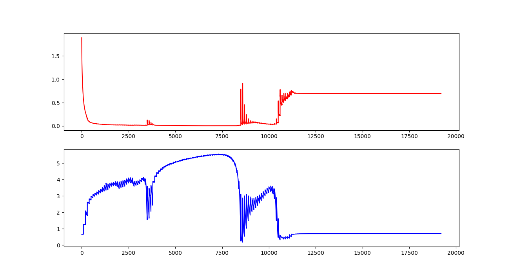

# Basic GAN
Code of a basic GAN

## Dependencies
* numpy
* tensorflow
* matplotlab  

Use `pip` to install what you need.

## How to run

Just type `python basic_gan.py` in the terminal.

## Result

You can see the loss of both networks, like this:

The loss of the Generative network (Blue line) drops a lot, which means that the Discriminative network can't discriminate the differences between the real samples and the samples generated by G network.
